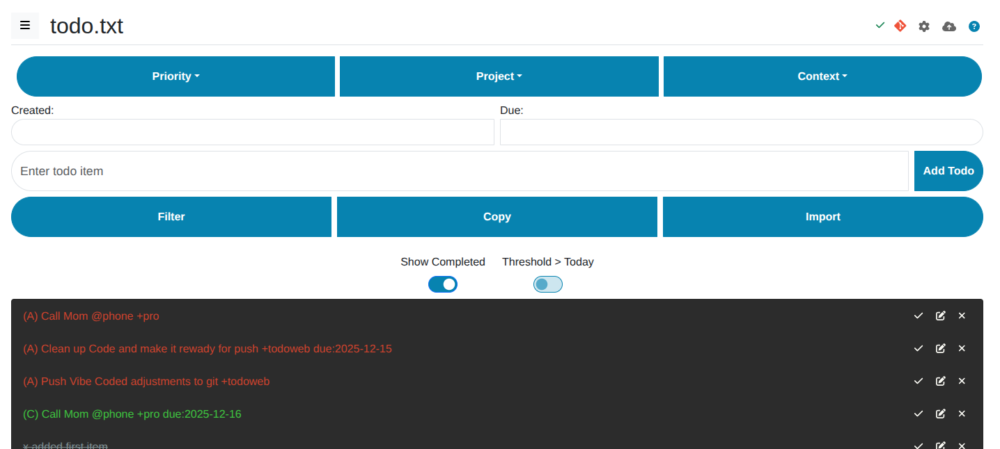

# Todo.txt Webapp

A Progressive Web Application (PWA) for managing todo.txt tasks list.

This webapp allows to manage tasks using the [todo.txt format](https://github.com/todotxt/todo.txt). It provides a simple web interface to view, add, and manage todo items.

This project utilizes the [jsTodoTxt](https://github.com/jmhobbs/jsTodoTxt) library by jmhobbs for parsing and manipulating todo.txt format. We appreciate the work of jmhobbs and the contributors to jsTodoTxt.

## Help

For detailed instructions on how to use the application's features, please see the [Help](help.md).



## Usage

To use the webapp for development:

1. **Install Node.js dependencies:**

```bash
npm install
```
This command installs the necessary packages for the development server.

2. **Start the development server:**
```bash
./start-server.sh
```
Or manually with verbose logging:
```bash
DEBUG=true node node-server.js --verbose
```
This command launches the Node.js server, which will serve the webapp with detailed logging.


3. **Optional: Generate local HTTPS certificates:**
To run the server with HTTPS (required for testing certain PWA features like installability more robustly or features requiring a secure context beyond `localhost`), and assuming `mkcert` is installed, generate the certificate files:
```bash
# Run this in the project's root directory
mkcert localhost 127.0.0.1 ::1
```
This generates `localhost+N.pem` and `localhost+N-key.pem` files in the current directory, which the secure server command will automatically use. Only needed to do this once unless the certificates expire the directory is cleared. It is necessary to run `mkcert -install` once beforehand if you haven't already configured the local CA.

4. **start secure server**
```bash
node node-server.js --secure [--verbose]
```

5. **Open `index.html` in your web browser:**
Once the server is running, you can access the webapp by navigating to the server address in your browser. Typically, this will be `http://localhost:5001` or `https://localhost:8443` if using secure mode.

## Git Sync Backend

This application uses **Git** as the sync backend, replacing the previous Dropbox integration. All todo files are stored in a Git repository with automatic version control.

### Features:
- **Pull-before-write workflow** - always pulls latest before committing changes
- **Automatic Git commits** on every save (debounced 3 seconds)
- **Intelligent merging** - handles concurrent changes from multiple sources
- **SSH key generation** - automatically creates SSH keys on first run
- **Optional remote sync** - push/pull to GitHub, GitLab, or any Git remote
- **Local-first** - works perfectly without any remote repository
- **Version history** - view commit history for each file

### How It Works:
1. When you make a change, it's marked as "pending"
2. After 3 seconds (debounce), the sync process starts:
   - **Step 1:** Pull latest version from Git
   - **Step 2:** Merge with local changes if needed
   - **Step 3:** Commit to Git
3. When switching files, the latest version is pulled automatically

### Configuration:

1. **Enable Git Sync:**
   - Click the Git icon in the top-right corner of the webapp
   - This enables automatic commits to the local Git repository

2. **Configure Git Settings (Optional):**
   - Click the gear icon to open Git configuration
   - Set your name and email for commits
   - Configure a remote repository URL (SSH format: `[email protected]:user/repo.git`)
   - Copy the generated SSH public key and add it to your Git hosting service

3. **Data Storage:**
   - Todo files: `/tmp/tododata/` (configurable via `TODO_DATA_DIR` env var)
   - SSH keys: `~/.config/todotxt-git/` (configurable via `TODO_CONFIG_DIR` env var)
   - Git repository: `/tmp/tododata/.git`

4. **Docker Setup:**
   ```bash
   # Start with logs visible
   docker-compose up
   
   # Or start in background
   docker-compose up -d
   
   # View logs
   docker-compose logs -f todo-webapp
   
   # Interactive debugging
   ./debug-docker.sh
   ```
   
   The Docker setup automatically:
   - Mounts `/tmp/tododata` for todo files
   - Persists SSH keys in a Docker volume
   - Installs Git and SSH client
   - Enables verbose logging by default

### Remote Repository Setup (Optional):

To sync with a remote Git repository (GitHub, GitLab, etc.):

1. Create a repository on your Git hosting service
2. In the webapp, click the gear icon and enter the SSH URL
3. Copy the SSH public key from the config dialog
4. Add the public key to your Git hosting service (Settings → SSH Keys)
5. Click the cloud icon to sync with the remote repository

## Troubleshooting

If you encounter issues:

1. **Check the logs:**
   ```bash
   # Docker
   docker-compose logs -f todo-webapp
   
   # Or use the interactive debug helper
   ./debug-docker.sh
   ```

2. **Enable verbose logging:**
   ```bash
   DEBUG=true node node-server.js --verbose
   ```

3. **See the [TROUBLESHOOTING.md](TROUBLESHOOTING.md) guide** for detailed solutions to common issues.

## Contributing

Contributions to the Todo.txt Webapp project are welcome. For major changes, please open an issue first to discuss what you would like to change.

## License

This project is licensed under the MIT License - see the [LICENSE](LICENSE) file for details.
